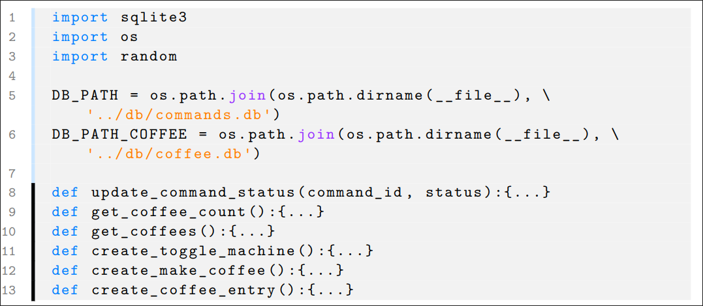

# Das File 'pythonstyle.sty' ist eine LaTex datei, welche als bibliothek in einem LaTex Dokument eingebunden weden kann um python code schön darzusstelen mit folgender zeile wird es eingebunden
 ```latex 
 \usepackage{pythonstyle} 
 ```

# genutzt werden kann es z.B. folgendermasen
 ```latex 	
    \scriptsize
	
	\begin{python}
import sqlite3
import os
import random

DB_PATH = os.path.join(os.path.dirname(__file__), '../db/commands.db')
DB_PATH_COFFEE = os.path.join(os.path.dirname(__file__), '../db/coffee.db') 

`\HL`def update_command_status(command_id, status):{...}
`\HL`def get_coffee_count():{...}
`\HL`def get_coffees():{...}
`\HL`def create_toggle_machine():{...}
`\HL`def create_make_coffee():{...}
`\HL`def create_coffee_entry():{...}
	\end{python}
```

### das alles was als python code innerhalb des python enviorments steht nicht eingerückt ist, ist korrekt, alle einrückungen sind automatisch im code sichtbar

## Obiger code würde in folgendem resultieren:

